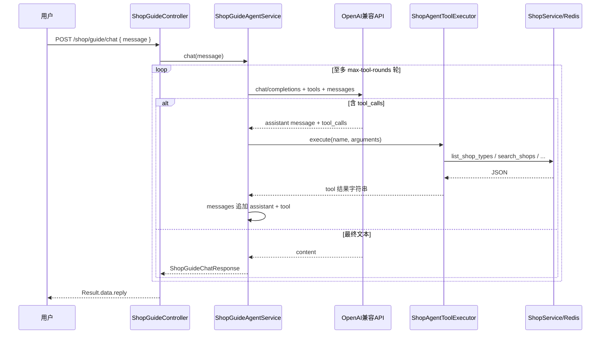

# HM 点评项目说明

本文档面向开发与运维人员，说明仓库结构、技术栈、运行方式，以及**智能导购**模块的设计与使用方式。

---

## 1. 项目概述

本项目是基于 **Spring Boot 2.3** 的点评类后端演示工程，提供商铺、优惠券、用户、博客、点赞与 Kafka 异步消费能力，并集成 **Redis**（缓存、分布式锁、GEO 附近搜索）、**MySQL + MyBatis-Plus** 等典型互联网的读写模式。

在此基础上，项目新增 **智能导购**能力：通过对接 **OpenAI 兼容的 Chat Completions API**，使用 **Function Calling（tools）** 将底层商户查询接口封装为**Agent 工具**，使用户可用**泛自然语言**组合「类型、名称、商圈、价格、评分、销量、距离」等多维条件完成检索与推荐说明。

---

## 2. 技术栈与依赖

| 类别 | 技术 |
|------|------|
| 运行时 | Java 8 |
| 框架 | Spring Boot 2.3.12 |
| Web | Spring MVC |
| 持久层 | MyBatis-Plus 3.4.3，MySQL 5.x 驱动 |
| 缓存 | Spring Data Redis + Lettuce，Redisson |
| 消息 | Spring Kafka |
| 工具库 | Hutool、Fastjson、Lombok、Caffeine |

**说明：** 智能导购侧 HTTP 调用使用 Spring `RestTemplate`，请求体/响应体使用 **Fastjson `JSONObject`** 解析，无需额外引入官方 OpenAI Java SDK，便于切换任意 OpenAI 协议兼容网关。

---

## 3. 目录结构（核心）

```
src/main/java/com/hmdp/
├── HmDianPingApplication.java    # 启动类（扫描 com.*）
├── agent/                        # 【智能导购】LLM 编排与工具定义
│   ├── ShopAgentToolDefinitions.java   # tools JSON Schema
│   ├── ShopAgentToolExecutor.java      # 函数名 → 业务方法
│   ├── ShopGuideAgentService.java      # 多轮 chat + tool_calls 循环
│   └── config/
│       ├── LlmOpenAiProperties.java    # llm.openai.* 配置绑定
│       └── LlmClientConfig.java         # RestTemplate Bean
├── controller/                   # REST 接口
│   ├── ShopController.java       # 传统商铺 CRUD/分页/按名检索/类型+GEO
│   └── ShopGuideController.java  # POST /shop/guide/chat
├── service/                     # 业务服务
│   └── impl/ShopServiceImpl.java # 含 queryShopByType、searchShopsMulti
├── entity/                      # tb_shop、tb_shop_type 等
├── dto/                         # Result、ShopGuideChatRequest/Response
└── config/                      # MyBatis、Mvc 拦截器等
```

点赞子域位于 `com.like.*`，与点评主域并列扫描。

---

## 4. 配置与运行

### 4.1 数据库与中间件

编辑 `src/main/resources/application.yaml`：

- `spring.datasource.*`：MySQL 地址、库名、`hmdp`
- `spring.redis.*`：Redis 连接（商铺 GEO、缓存等依赖 Redis）
- `spring.kafka.*`：如需消息功能再按需配置

### 4.2 智能导购 LLM 配置

```yaml
llm:
  openai:
    base-url: https://api.openai.com/v1
    api-key: ${LLM_OPENAI_API_KEY:}
    model: gpt-4o-mini
    max-tool-rounds: 5
```

- **base-url**：须指向 OpenAI 兼容服务的根路径（**含 `/v1`**）。国内厂商若文档为 `https://xxx/v1`，保持一致即可。
- **api-key**：建议通过环境变量 `LLM_OPENAI_API_KEY` 注入，避免写入版本库。
- **model**：按供应商实际可用模型填写。
- **max-tool-rounds**：单次用户提问内，允许模型多轮调用工具的上限，防止异常循环。

### 4.3 启动

```text
mvn spring-boot:run
```

默认端口见 `server.port`（示例为 `8081`）。

---

## 5. 商铺相关业务能力摘要

### 5.1 已有接口（节选）

| 方法 | 路径 | 作用 |
|------|------|------|
| GET | `/shop/{id}` | 按 ID 查详情（带缓存穿透处理） |
| GET | `/shop/of/type` | 按类型分页；若传 `x,y` 则走 Redis GEO 距离排序（约 5km） |
| GET | `/shop/of/name` | 名称模糊分页 |
| GET | `/shop-type/list` | 商铺类型列表 |

### 5.2 新增：多维度数据库组合检索

服务层方法：`IShopService#searchShopsMulti`

支持条件（均为可选组合）：

- `typeId`：类型 ID  
- `nameKeyword`：名称模糊  
- `area`：商圈模糊  
- `minAvgPrice` / `maxAvgPrice`：人均区间  
- `minScoreStars`：最低评分（1～5 星，内部映射为 `tb_shop.score` 的十倍整数）  
- `minSold`：最低销量  
- `current`：页码（每页条数沿用 `SystemConstants.DEFAULT_PAGE_SIZE`）

排序：评分降序、销量降序。返回 `Result` 中带 `data`（列表）与 `total`（总条数）。

---

## 6. 智能导购模块设计

### 6.1 目标

- 用户用自然语言描述需求，例如：「陆家嘴附近人均 200 以内、4 星以上的奶茶店」。
- 大模型只做**意图理解与参数抽取**，**不得编造**店铺数据。
- 所有可核验的事实（列表、评分、地址等）必须通过 **Tool 调用** 落到底层 `Shop` 查询。

### 6.2 架构流程



### 6.3 工具（Agent Tools）一览

| 工具名 | 底层能力 | 适用场景 |
|--------|-----------|----------|
| `list_shop_types` | `IShopTypeService` 列表 | 将「美食/奶茶」等中文类型映射为 `type_id` |
| `search_shops` | `searchShopsMulti` | 无坐标时的多维条件组合检索 |
| `search_shops_nearby` | `queryShopByType` + Redis GEO | 有经纬度时按距离排序 |
| `get_shop_by_id` | `queryById` | 用户点名某 ID 或二次确认详情 |

工具声明集中在 `ShopAgentToolDefinitions`，与 OpenAI `tools[].function` 结构一致，便于替换模型或网关。

### 6.4 HTTP 接口

- **URL：** `POST /shop/guide/chat`
- **Content-Type：** `application/json`
- **请求体：**

```json
{
  "message": "想喝奶茶，人均别太贵，评分至少4星，最好在浦东商圈"
}
```

- **成功响应体（`Result` 包装）：**

```json
{
  "success": true,
  "errorMsg": null,
  "data": {
    "reply": "根据查询……",
    "usedTools": true
  },
  "total": null
}
```

`usedTools` 表示本轮是否发生过至少一次工具调用，便于调试与观测。

### 6.5 登录与拦截

`MvcConfig` 中已对 `/shop/**` 排除登录校验，故 **`/shop/guide/**` 与既有商铺接口一致，无需登录即可访问**。若生产环境需要鉴权，可缩小排除范围，仅保留必要匿名路径。

---

## 7. 使用注意与扩展建议

1. **坐标与附近搜索**：`search_shops_nearby` 依赖有效的 `longitude/latitude` 及 Redis 中 GEO 数据初始化（与原课程「导入商铺坐标到 GEO」一致）。若 GEO 未预热，返回可能为空，应在回复中说明数据或配置问题。
2. **模型兼容性**：需使用支持 **tools / function calling** 的模型；若提供商字段名略有差异，可在 `ShopGuideAgentService#postChatCompletions` 中适配。
3. **安全**：`api-key` 务必走环境变量或密钥管理；对外暴露的导购接口建议加流控与审计。
4. **扩展**：可增加工具（如优惠券查询、用户收藏偏置），保持「工具只做结构化查询、模型只做解释与交互」的分层。

---

## 8. 版本与维护

- **应用名：** `hmdp`（`spring.application.name`）
- **Maven 坐标：** `com.hmdp:hm-dianping:0.0.1-SNAPSHOT`

智能导购相关变更集中于 `com.hmdp.agent` 包与 `ShopServiceImpl#searchShopsMulti`、`ShopController` 同级之 `ShopGuideController`。升级 Spring Boot  major 版本时，需重点 Regression 测试 `RestTemplate` 与 JSON 序列化字段命名。

---

*文档随功能迭代更新；若与代码不一致，以当前源码为准。*
